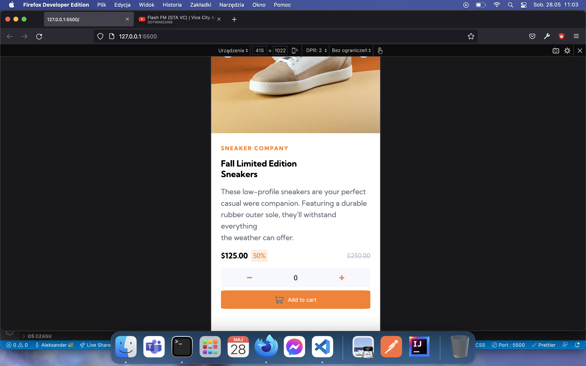
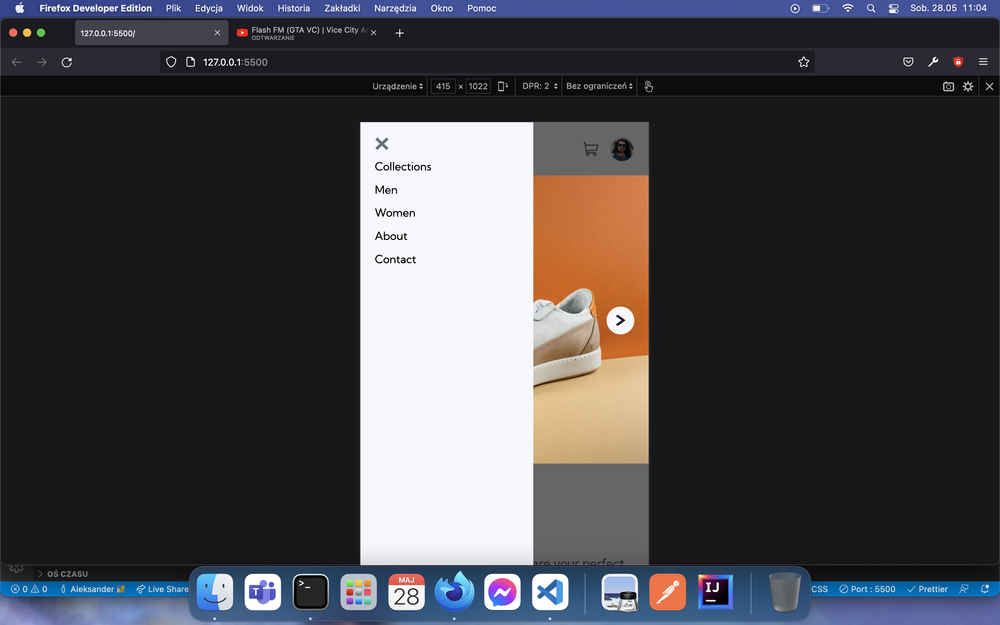
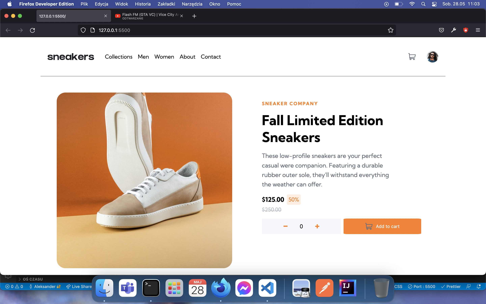
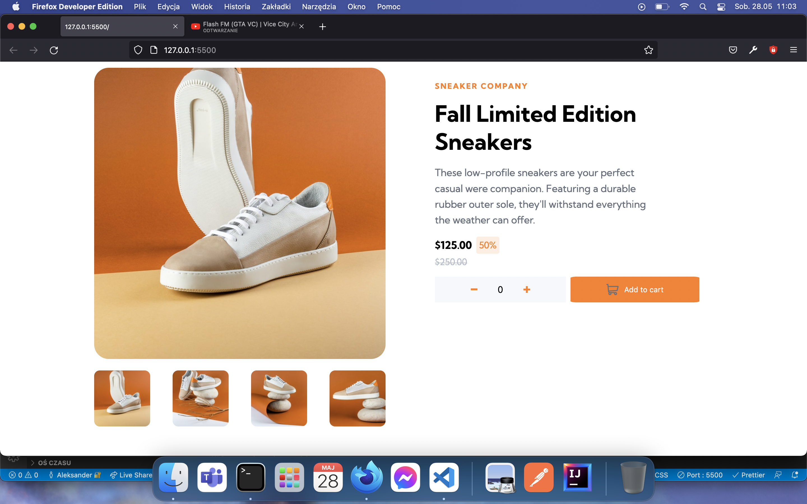
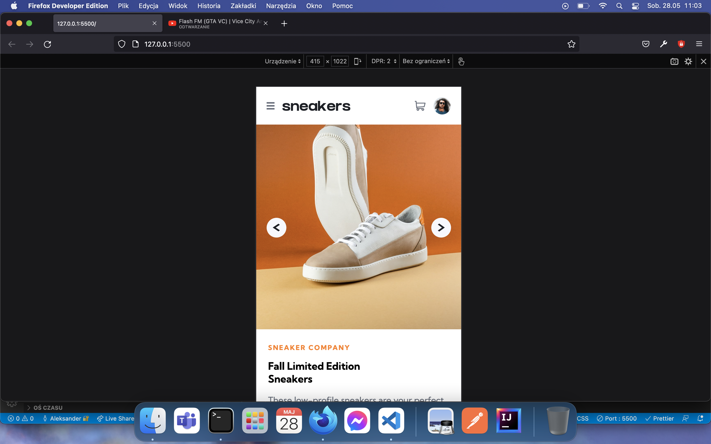
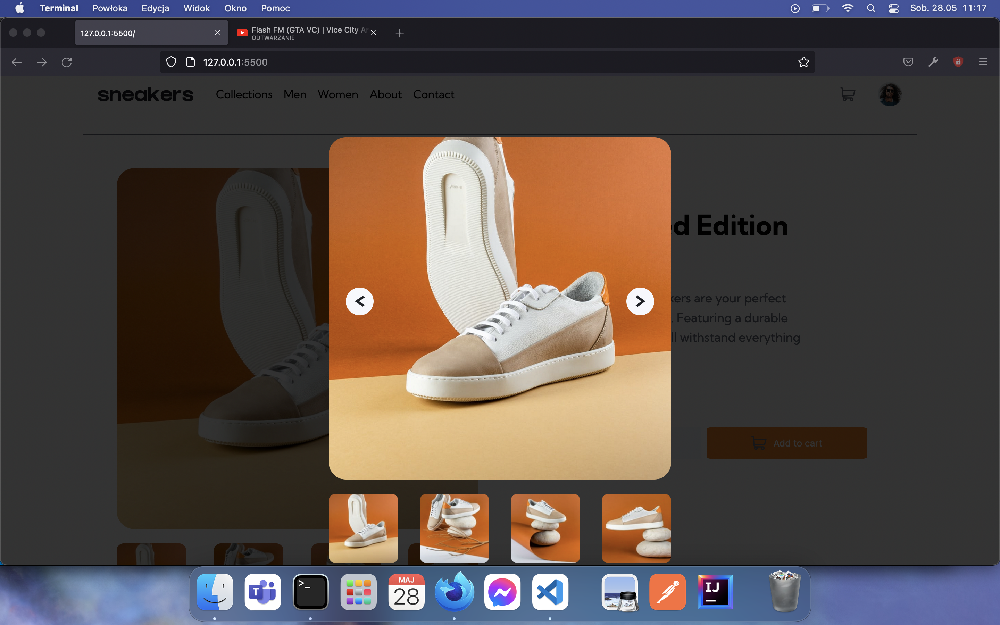

# About

- This is a challenge from Frontend Mentor where I had to copy specific Design.
- Only Pure HTML, CSS and JavaScript were allowed.

# Reflections

- It was very easy to do with mobile first approach.

- Making specific design in Pure HTML, CSS And JavaScript is fun, but to be honest, I would prefer to have a project with more complex logic rather than just static website.

# Screenshots

